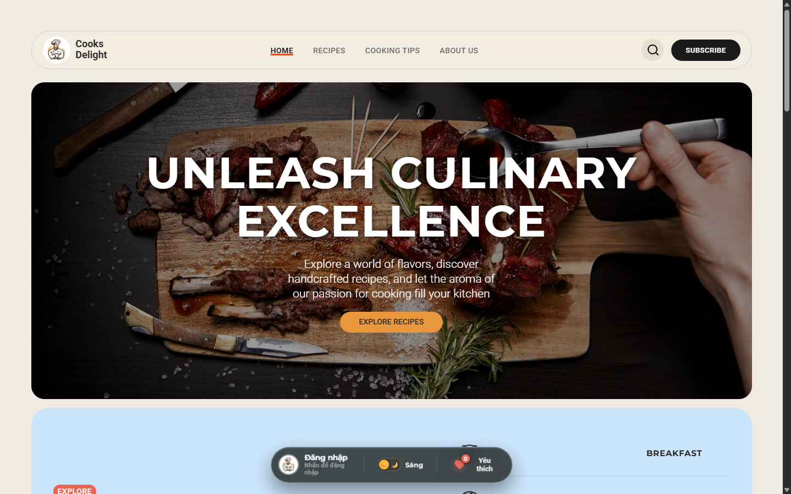
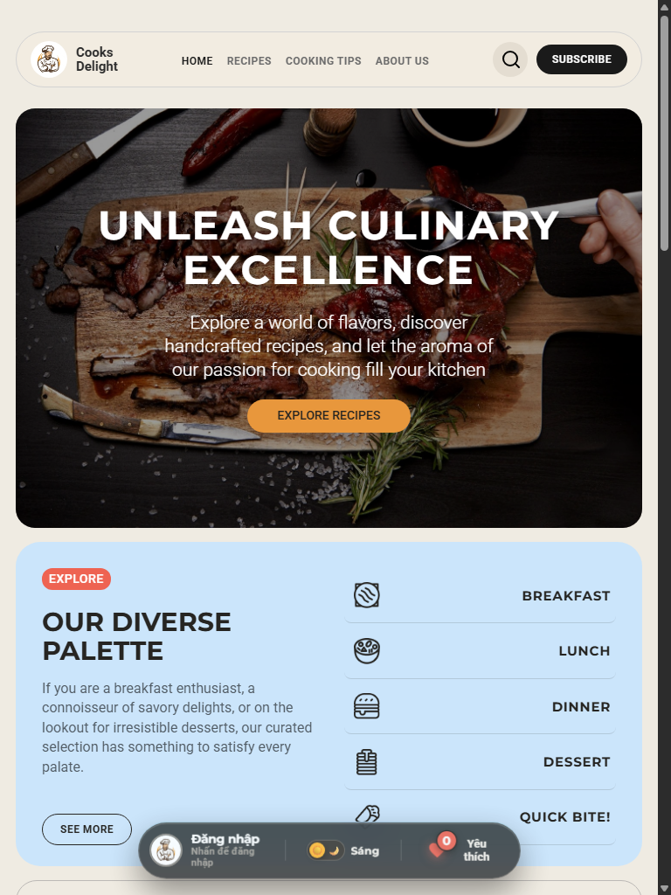
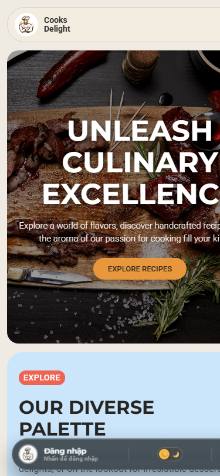

# 🍳 COOKS DELIGHT - CULINARY BLOG & RECIPE PLATFORM

> **Cooks Delight** là nền tảng blog ẩm thực hiện đại chuyên cung cấp các công thức món ăn phong phú, cẩm nang mẹo làm bếp thực chiến và câu chuyện ẩm thực đa văn hóa. Dự án sở hữu giao diện chuẩn tạp chí cao cấp, hỗ trợ trải nghiệm liền mạch trên mọi thiết bị và tích hợp nhiều tính năng nổi bật như Dark Mode, Taskbar nổi, quản lý danh sách yêu thích và hệ thống đăng ký bản tin sinh động.

---

## 📌 Thông tin đề tài & Liên kết trực tuyến

* **Tên đề tài:** Cooks Delight – Cooking Recipes & Culinary Blog Template
* **Môn học:** Thiết kế Web (INTE03010)
* **Giảng viên hướng dẫn:** Thầy Võ Việt Khoa
* **🎨 Link thiết kế Figma (Bản gốc):** [Free Cooking Recipes Blog Template (Figma Community)](https://www.figma.com/community/file/1331351586208563684/free-cooking-recipes-blog-template)
* **🚀 Link sản phẩm đã triển khai (Deploy):** [https://nauancungminh.netlify.app](https://nauancungminh.netlify.app)
* **📦 Kho mã nguồn GitHub:** [https://github.com/2551050196tai-boop/B-i-t-p-l-n](https://github.com/2551050196tai-boop/B-i-t-p-l-n)
* **🎥 Video Demo (5 phút):** [Google Drive Video Demo](https://drive.google.com/file/d/1OvlI4My7n3YgJrqPPQtDaB-aCx7LYcrc/view?usp=sharing)

---

## 👥 Danh sách thành viên & Phân công nhiệm vụ

| STT | Họ và tên | MSSV | Vai trò | Trang phụ trách | Chức năng JS & Phần việc chính | Tỷ lệ đóng góp |
| :-: | :--- | :-: | :--- | :--- | :--- | :-: |
| 1 | **Đỗ Đức Tài** | 2551050196 | **Nhóm trưởng** | Chi tiết món ăn (`recipe-detail.html`), Taskbar Dock toàn site | • Universal Dark Mode toàn cục, lưu `localStorage`<br>• Quản lý Tài khoản & Hồ sơ người dùng<br>• Quản lý Yêu thích (Favorites) & Huy hiệu Dock<br>• Subscribe nhận tin & Chuông YouTube `@keyframes`<br>• Live Search tức thì (Desktop & Mobile)<br>• Kiến trúc Responsive, Dataset `api.js` & Đo đạc Lighthouse | **50%** |
| 2 | **Lê Đăng Khoa** | 2551050108 | **Thành viên** | Trang chủ (`index.html`), Giới thiệu (`ABOUT_US.html`) | • Carousel slider món ăn nổi bật (Featured Recipes)<br>• Bộ lọc Embark on a Journey (Thuật toán bù 6 thẻ)<br>• Hiệu ứng cuộn và thanh điều hướng Navbar<br>• Menu di động dạng thanh bên (Mobile Drawer Menu)<br>• Xây dựng bố cục tạp chí và mạng xã hội | **25%** |
| 3 | **Nguyễn Đức Thuận** | 2551050214 | **Thành viên** | Công thức (`RECIPES.html`), Mẹo làm bếp (`COOKINGS TIPS.html`) | • Bộ lọc công thức đa tiêu chí (Filter Pills)<br>• Thuật toán phân trang động 15 món/trang (Pagination)<br>• Xử lý chuyển trang Next / Prev không reload trang<br>• Cân chỉnh khoảng cách đệm trước khối Subscribe<br>• Thiết lập lưới CSS Grid 4 cẩm nang mẹo làm bếp | **25%** |

---

## 📱 Ảnh chụp màn hình tại 3 Breakpoint (Responsive Screenshots)

Dự án được tối ưu hóa hiển thị chuẩn xác trên cả 3 cấp độ màn hình:

### 1. 🖥️ Desktop Breakpoint (`>= 1024px` — 1440px)
Bố cục hiển thị đầy đủ thanh điều hướng ngang, lưới 3 cột cân xứng, hiệu ứng hover mượt mà và thanh Taskbar nổi cố định ở đáy màn hình.



---

### 2. 💻 Tablet Breakpoint (`768px - 1023px` — 768px)
Bố cục co giãn linh hoạt thành lưới 2 cột, tối ưu khoảng cách đệm (padding) và kích thước typography giúp trải nghiệm chạm vuốt trên máy tính bảng trực quan.



---

### 3. 📱 Mobile Breakpoint (`<= 767px` — 375px)
Chuyển đổi thanh điều hướng sang Menu Drawer trượt từ cạnh phải, bố cục xếp dọc 1 cột tối ưu cuộn trang một tay, tối giản kích thước nút bấm và hỗ trợ thanh tìm kiếm di động riêng biệt.



---

## ✨ Các tính năng nổi bật của hệ thống

1. **Universal Dark Mode (Chế độ Tối)**: Chuyển đổi giao diện Sáng / Tối mượt mà qua công tắc trượt trên thanh Taskbar, áp dụng bảng màu ấm Warm Charcoal (`#171614`, `#23211e`, `#ede8dc`), đồng bộ toàn site và lưu trạng thái vào `localStorage` chống chớp sáng (FOUC).
2. **Thanh Taskbar nổi (Floating Glass Dock)**: Thiết kế kính mờ (Glassmorphism) cố định ở đáy màn hình giúp truy cập nhanh Hồ sơ tài khoản, Món ăn yêu thích và Dark Mode.
3. **Quản lý Món ăn Yêu thích (Favorites)**: Thả tim trực tiếp từ thẻ món ăn, tự động cập nhật số lượng huy hiệu trên thanh dock và xem danh sách yêu thích trong modal riêng.
4. **YouTube-style Subscribe Celebration**: Đăng ký nhận tin qua email với hiệu ứng mở hộp thông báo và rung chuông YouTube sinh động.
5. **Live Search thời gian thực**: Thanh tìm kiếm trực tiếp gợi ý kết quả tức thì kèm hình ảnh đại diện và thông tin danh mục.
6. **Thuật toán Phân trang động (Pagination)**: Chia đều 15 món/trang với bộ chuyển trang tiện lợi.

---

## 🛠️ Công nghệ sử dụng

| Lĩnh vực | Công nghệ / Thư viện |
| :--- | :--- |
| **Cấu trúc & Đánh dấu** | HTML5 Semantic Elements (`<header>`, `<nav>`, `<main>`, `<section>`, `<article>`, `<footer>`) |
| **Giao diện & Bố cục** | CSS3, CSS Grid (`repeat`, `minmax`, `fr`), Flexbox, CSS Variables, `clamp()`, Keyframes Animation |
| **Xử lý Logic & Tương tác** | JavaScript (ES6+ Modular, DOM APIs, `MutationObserver`, `LocalStorage`, `Fetch API`) |
| **Phông chữ & Biểu tượng** | Google Fonts (*Montserrat*, *Roboto*, *Nunito Sans*), SVG Icons, FontAwesome |
| **Kiểm thử & Đánh giá** | Google Lighthouse (Đạt điểm số tuyệt đối 100/100 cả 4 hạng mục) |
| **Triển khai CI/CD** | Git, GitHub Repository, Netlify Hosting (Auto Deploy from `main`) |

---

## 🚀 Hướng dẫn cài đặt & Chạy dự án

### Cách 1: Xem trực tiếp qua link triển khai (Khuyên dùng)
Truy cập trực tiếp sản phẩm đã được deploy tại: [**https://nauancungminh.netlify.app**](https://nauancungminh.netlify.app)

### Cách 2: Chạy cục bộ bằng Visual Studio Code (Localhost)
1. **Tải mã nguồn**:
   ```bash
   git clone https://github.com/2551050196tai-boop/B-i-t-p-l-n.git
   cd B-i-t-p-l-n
   ```
2. **Mở dự án trong VS Code**:
   ```bash
   code .
   ```
3. **Khởi chạy máy chủ nội bộ**:
   - Cài đặt extension **Live Server** trong VS Code (nếu chưa có).
   - Nhấn chuột phải vào tệp `index.html` và chọn **"Open with Live Server"** (hoặc mở trực tiếp file `index.html` bằng trình duyệt Chrome/Edge).
4. **Trải nghiệm các tính năng**:
   - Nhấn vào công tắc **☀️ / 🌙** trên thanh Taskbar để đổi chế độ Dark Mode.
   - Thử nghiệm: Thả tim món ăn, Đăng ký nhận tin Subscribe, Tìm kiếm món ăn, và thay đổi kích thước cửa sổ để kiểm tra tính tương thích Responsive.

---

## 📂 Cấu trúc thư mục dự án

```text
Cooks-Delight/
│
├── index.html              # Trang chủ
├── RECIPES.html            # Trang danh sách tất cả công thức nấu ăn
├── COOKINGS TIPS.html      # Trang mẹo và kỹ năng làm bếp
├── ABOUT_US.html           # Trang giới thiệu về đầu bếp & sứ mệnh
├── recipe-detail.html      # Trang chi tiết một công thức món ăn
├── README.md               # Tài liệu giới thiệu dự án
├── BAO_CAO_BAI_TAP_LON_COOKS_DELIGHT.doc  # Báo cáo bài tập lớn định dạng Microsoft Word
├── BAO_CAO_BAI_TAP_LON_COOKS_DELIGHT.html # Báo cáo bài tập lớn định dạng xem & in PDF
│
├── css/                    # Thư mục stylesheet giao diện
│   ├── HOME.css            # Style trang chủ & media queries
│   ├── RECIPES.css         # Style trang công thức & phân trang
│   ├── COOKINGS TIPS.css   # Style trang mẹo nấu ăn
│   ├── ABOUT_US.css        # Style trang giới thiệu
│   ├── FOOD-RECIPES.css    # Style trang chi tiết công thức
│   └── user-dock.css       # Style thanh Taskbar, Dark Mode, Modals, Toasts
│
├── js/                     # Thư mục xử lý logic JavaScript
│   ├── script.js           # Mô-đun liên kết chính
│   ├── api.js              # Xử lý nguồn dữ liệu món ăn (Shared Meals Dataset)
│   ├── home.js             # Logic slider & bộ lọc Embark trang chủ
│   ├── recipes.js          # Logic lọc & phân trang 15 món trang RECIPES
│   ├── recipe-detail.js    # Logic render nội dung chi tiết món ăn
│   ├── search.js           # Logic tìm kiếm thời gian thực (Desktop & Mobile)
│   ├── navbar.js           # Hiệu ứng cuộn và thanh điều hướng
│   ├── mobile-menu.js      # Logic mở/đóng Sidebar menu di động
│   └── user-dock.js        # Logic Quản lý Tài khoản, Món yêu thích, Dark Mode & Subscribe
│
└── assets/                 # Thư mục hình ảnh, biểu tượng & font icon
    ├── picture/            # Hình ảnh món ăn, ảnh bìa, avatar, banner, SVG icons
    │   └── screenshots/    # Ảnh chụp màn hình 3 breakpoint (Desktop, Tablet, Mobile)
    └── favicon_io/         # Bộ favicon đa kích thước cho trình duyệt
```

---

## 👨‍💻 Tác giả & Bản quyền

* **Dự án:** Bài tập lớn môn Thiết kế Web – Cooks Delight Blog
* **Phát triển bởi:** Đội ngũ Cooks Delight (**Đỗ Đức Tài**, **Lê Đăng Khoa**, **Nguyễn Đức Thuận**)
* **Bản quyền:** © 2026 Cooks Delight. All rights reserved.
